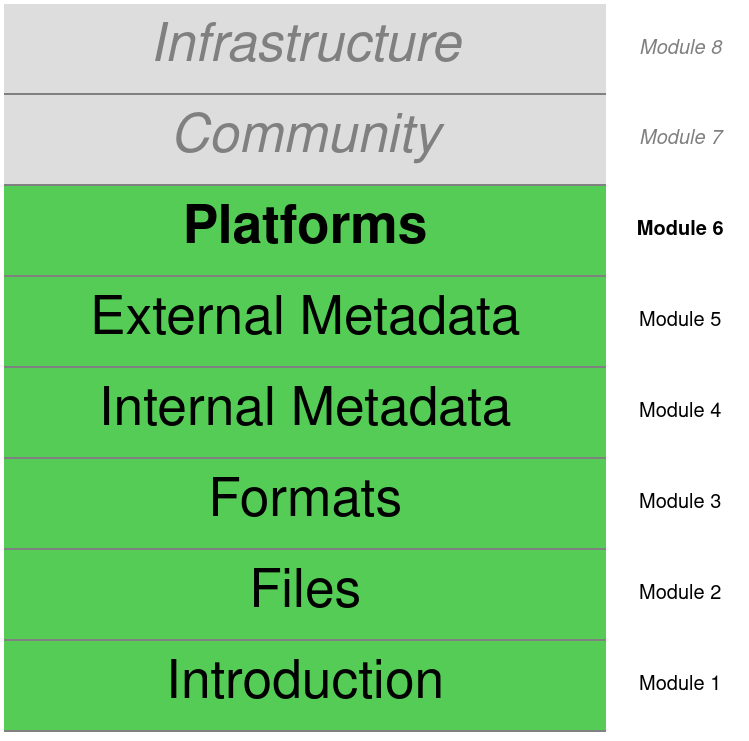

# Platforms

## Learning outcomes:

* Explain how and why platforms transform data.
* Trace the transformation of curated data.

## Readings:

* Gillespie, T. (2010). The Politics of Platforms. new media \& society, 12(3), p. 347-364. 

## Discussion:

* Why does Gillespie think that YouTube uses the term "platform" to describe itself?
* How does Gillespie think that YouTube and other platforms perform digital curation?

## Exercises:

* Use the YouTube API and youtube-dl to download a video. Compare what they allow you to do, and what data they make available.

